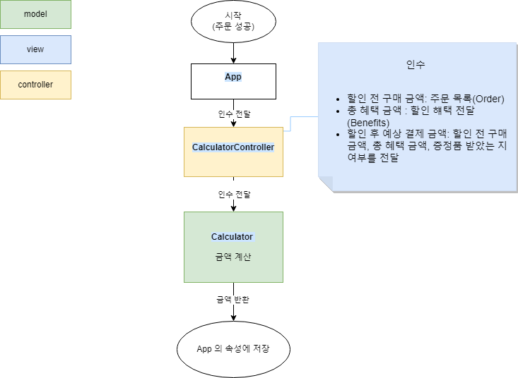

# 미션 - 크리스마스 프로모션

## 소개

우테코6기 4주차 [미션](https://github.com/woowacourse-precourse/javascript-christmas-6)에 대한 과제입니다.
단일 책임 원칙, MVC 디자인 패턴 적용, 도메인 로직 중심의 코드 구현과 테스트 코드 구현을 목표로 삼았습니다.

### 실행 화면


### 도메인 로직과 UI 로직

제가 생각하는 이번 과제의 도메인 로직와 UI 로직은 다음과 같습니다

#### 도메인 로직

- 예약 방문일에 대한 유효성 검사
- 주문 메뉴에 대한 유효성 검사
- 할인 전 총 주문 금액 계산
- 증정 여부 판단
- 이벤트 적용 여부 판단
- 이벤트 마다 할인 금액, 총 혜택 금액, 할인 후 예상 결제 금액 계산
- 이벤트 배지 부여 판단

#### UI 로직

- 예약 방문일 입력값 받기
- 예약 방문일자에 따른 혜택 미리보기 문구 출력
  ex: 방문일자가 3일 일때
  "12월 3일에 우테코 식당에서 받을 이벤트 혜택 미리 보기!"
- 주문 메뉴 받기
- 주문 메뉴 출력
- 총 주문 금액 출력
- 증정 여부 출력 (없으면 "없음", 증정 시 증정 물품 가격으로)
- 이벤트 혜택 내역, 총 혜택 금액 ,할인 후 예상 결제 금액 출력 (이벤트 혜택 없으면 "없음")
- 적용되는 이벤트 배지 출력 (없으면 "없음")

### MVC 디자인 패턴

기능 구현에서 도메인 로직의 핵심은 이벤트,배지,주문,예약 방문일,금액(할인 금액, 총 혜택 금액, 할인 후 예상 결제 금액)이라고 생각했고 이들과 관련있는 것들을 모델로 하고
입력값에 대한 질문을 던지고, 입력값을 받아오는 InputView 와 메세지를 출력한 OutputView는 뷰로 설정했습니다.
입력값을 가져와 모델의 상태들을 업데이트하거나 상태들을 가공해서 출력할 메세지로 만드는 기능을 담당하는 것들은 컨트롤러로 정했습니다.

이 밖에 상수,유틸함수 폴더로 구조를 나누었습니다.

<details>
<summary>📜 파일 구조 보기</summary>
<div markdown="1">
  
```
📦src
 ┣ 📂constants
 ┃ ┣ 📜EventRule.js  : 이벤트들에 대한 상수 관리
 ┃ ┣ 📜index.js
 ┃ ┣ 📜Menu.js : 메뉴들에 대한 상수 관리 
 ┃ ┣ 📜Message.js : 입력 쿼리,출력메세지 관리
 ┃ ┣ 📜RegexPattern.js : 정규표현식의 패턴 관리
 ┃ ┗ 📜Rule.js : 유효성 검사등에 쓰이는 형식에 대한 매직넘버등의 상수 관리
 ┣ 📂controllers
 ┃ ┣ 📜EventController.js : 주문 입력값를 이벤트 모델들에게 넘겨 이벤트 혜택 여부를 판단하고 혜택 리스트를 반환
 ┃ ┣ 📜index.js
 ┃ ┣ 📜InputController.js : 입력값을 받아 해당 입력값에 대한 유효성 검사를 진행하는 모델에게 넘기고 유효한 값을 반환
 ┃ ┣ 📜Money.js : 금액을 알맞은 출력 메세지로 변경해 반환
 ┃ ┗ 📜OutputController.js : 값을 받아서 알맞을 출력 메세지로 변환해 Output에세 전달해 메세지를 출력
 ┣ 📂models
 ┃ ┣ 📂events : 이벤트 적용에 대한 판단과 할인 금액 반환
 ┃ ┃ ┣ 📜GiftEvent.js
 ┃ ┃ ┣ 📜index.js
 ┃ ┃ ┣ 📜SpecialEvent.js
 ┃ ┃ ┣ 📜WeekDayEvent.js
 ┃ ┃ ┣ 📜WeekendEvent.js
 ┃ ┃ ┗ 📜XmasDDayEvent.js
 ┃ ┣ 📜Badge.js : 배지 수여 여부 판단과 수여되는 배지 반환
 ┃ ┣ 📜Calculator.js : 할인전 금액, 총 혜택 금액, 할인 후 예상 결제액  계산 
 ┃ ┣ 📜CustomError.js 
 ┃ ┣ 📜index.js
 ┃ ┣ 📜Order.js : 주문한 메뉴들에 대한 유효성 검사 진행 및 유효한 주문 리스트와 주문 개수 반환
 ┃ ┣ 📜OrderedMenu.js : 주문 받은 각각의 메뉴들을 food,numberOfMenu의 속성을 가지는 객체로 반환
 ┃ ┗ 📜ReservationDate.js : 예약 방문일에 대한 유효성 검사 진행 및 유효한 방문일 반환
 ┣ 📂utils
 ┃ ┣ 📜EventUtils.js : 이벤트와 관련된 유틸함수 관리
 ┃ ┣ 📜Freeze.js : 객체를 freeze하는 유틸함수 관리
 ┃ ┣ 📜index.js 
 ┃ ┣ 📜MessageFactory.js : 출력 메세지들을 만드는 유틸함수 관리
 ┃ ┗ 📜RegexFactory.js : 정규표현식을 사용하는 유틸함수 관리
 ┣ 📂views
 ┃ ┣ 📜index.js
 ┃ ┣ 📜InputView.js : 사용자에게 입력값을 받음
 ┃ ┗ 📜OutputView.js : 사용자에게 메세지 출력
 ┣ 📜App.js
 ┗ 📜index.js

````
</div>
</details>

### 순서도

#### 예약 방문일, 메뉴 주문 받기 및 유효성 검사


#### 이벤트 혜택 적용 판단


#### 금액 계산 (할인 전 구매 금액, 총 혜택금액, 할인 후 예상 결제 금액)



#### 배지 적용 여부 판단


## 매개변수 타입 정리

### order

- 사용자가 주문한 메뉴 목록

```typescript
type FoodName ="양송이스푸"|"타파스"|....|"샴페인";
type FoodType ='appetizer'|'main'|'dessert'|'beverage' ;
type OrderMenu ={ food:string, type:FoodType, price:number, numberOfOrder:number};
type Order =OrderMenu[];
````

### benefits

- 사용자가 받는 이벤트 혜택 목록

```typescript
type Event =
  | '크리스마스 디데이 할인'
  | '평일 할인'
  | '주말 할인'
  | '특별 할인'
  | '증정 이벤트';
type Benefits = { event: EventType; discount: number }[] | undefined;
```

### badge

```typescript
type BadgeName = '산타' | '트리' | '별';
type Badge = { name: BadgeName; icon: string };
```

## 설치 및 실행

### 설치

```dash
npm i
```

### 실행

```
node ./src/index.js
```

## 공부

### 객체와 클래스

OutputView, InputView가 클래스가 아닌 객체 형태로 제공되었고 클래스가 객체의 템플릿이라는 것을 알고 있었는데 과제에서 클래스와 객체를 구분해서 사용하지는 않았기에 객체와 클래스의 차이와 각각 언제 사용하는지 정리하고 넘어가고 싶었습니다.

클래스는 객체를 만드는 템플릿으로 객체를 반복해서 생성하며 생성된 객체의 속성이나 메서드를 변경하면서 독립적으로 사용하고 싶을 경우 이용하면 좋고 그렇지 않을 경우에는 객체를 사용하는게 좋습니다. 그 이유는 객체도 속성과 메서드를 변경할 수 있지만 동일한 객체가 여러 파일에서 사용될 예정이라면 객체가 변경되면 오류가 발생 할 수 있기 때문에 이 경우에는 클래스로 탬플릿을 만들어서 해당 클래스를 사용해 객체를 만들어야 된다고 생각합니다.

그래서 해당 과제에서는 반복적으로 사용되지만 속성이나 메서드의 변경이 없는 OutputView, InputView,OutputController, InputController, Calculator는 객체로 작업했습니다.

### 오류는 모델인가?

이번 미션에서는 오류에 관련한 CustomError를 모델로 관리했습니다. 유효성 검증은 도메인 로직에 속하기게 오류를 커스텀하는 CustomError도 도메인 로직에 속한다고 생각했기 때문입니다.

그러나 오류를 모델로 관리를 할 것인지 아니면 유틸함수나 따로 오류와 관련된 폴더를 만들어야 하는게 맞는 것인지는 아직 확신이 들지 않아 좀 더 생각해보아야 할 문제 같습니다.
